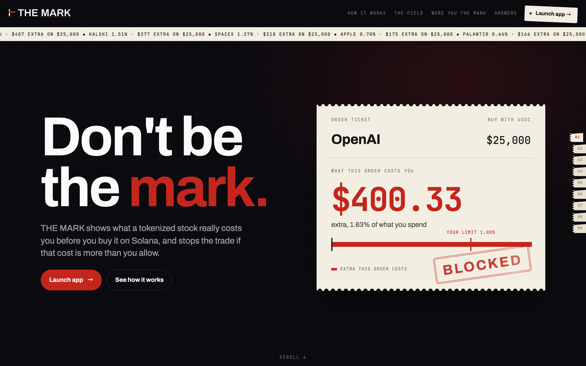
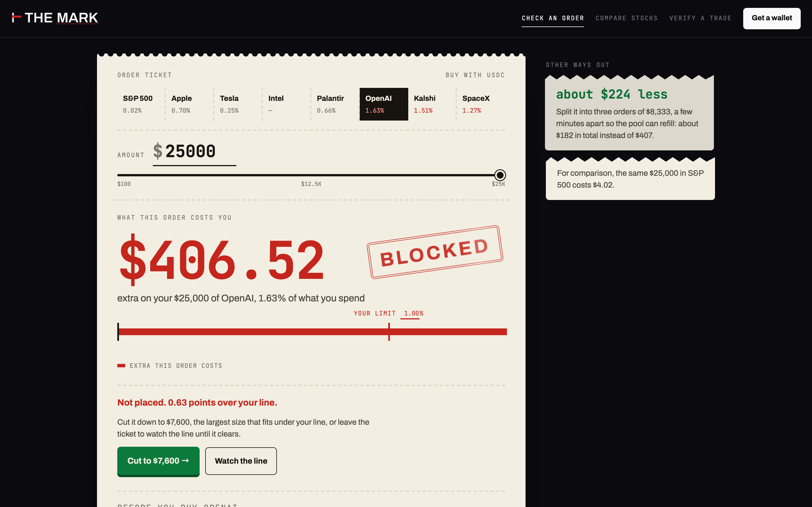
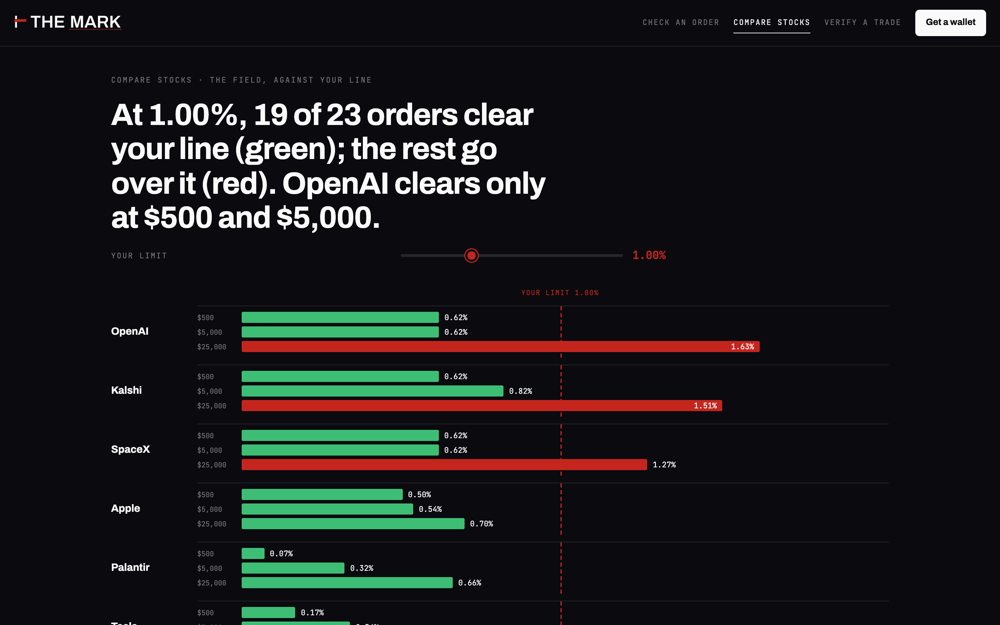
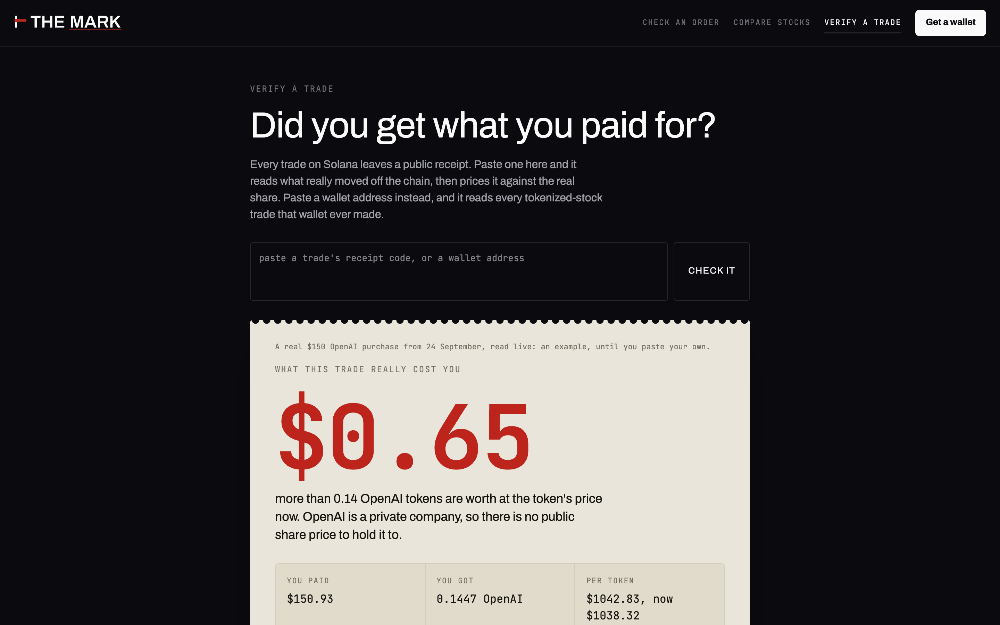

# THE MARK

What a tokenized stock really costs you before you buy it on Solana, and a stop on the trade if that cost is more than you allow.

**Live: [themark-nine.vercel.app](https://themark-nine.vercel.app)**



Tokenized stocks trade in pools that are thin at the wrong hours. A chart shows the token's price. It does not show what your order costs to fill: the price moving against you in the pool, plus the transfer fee some tokens charge on every move. On 22 September 2026 the gap between token and share was a median 0.20% across 20 pairs, while a $25,000 order cost between 0.06% and 2.56% to fill. The fill is where the money goes.

## Three pages

| Check an order | Compare stocks | Verify a trade |
|---|---|---|
|  |  |  |

- **Check an order.** The ticket is the app: pick a stock, set the amount and your limit on the line. Over the limit it is stamped BLOCKED and never reaches your wallet. One click cuts it to the largest size that fits, or leave it open and it re-quotes every 30 seconds until it clears.
- **Compare stocks.** Every stock at $500, $5,000 and $25,000, drawn against the limit you set. Green clears, red goes over.
- **Verify a trade.** Paste a trade's signature or a wallet address. Every tokenized-stock trade is read off the chain, priced, totalled and stamped against a 1% line, with the toll for selling what the wallet holds today.

## Where the numbers come from

Every figure is a live Jupiter quote for the exact order plus what the token's own mint says, read at the moment you look. No sample data and no placeholder price: when a read fails, the page says so and shows nothing in its place. The one shared reading, Compare, is refreshed every two minutes and labelled with its age.

| Part | Source |
|---|---|
| Price impact | Jupiter quote for the exact amount |
| Transfer fee | `transferFeeConfig` on the Token-2022 mint (Tessera's OpenAI, Kalshi and SpaceX charge 0.20%) |
| Balance multiplier | `scaledUiAmountConfig` on the mint; xStocks grow balances instead of paying dividends |
| Reference price | the real share for public companies, the token's own price for private ones |
| Issuer powers | the mint's extensions: whether the issuer can take tokens back, pause trading or run code on every transfer |

## Run it

```bash
git clone https://github.com/hemjay07/themark.git
cd themark && npm install
npm run dev          # http://localhost:3000
npm test             # 22 tests on the cost math
```

Both environment variables are optional: `JUPITER_API_KEY` (free, from the Jupiter portal) doubles the request rate, and `SOLANA_RPC_URL` replaces the two public endpoints the app rotates between. See `.env.example`.

`node scripts/check-v5.mjs http://localhost:3000` opens the app in Chrome and checks each page against live quotes.

Next.js 14 and TypeScript. Quotes from Jupiter, chain reads over Solana JSON-RPC, signing through Phantom. Hosted on Vercel.

Made for the [Stocklana](https://stocklana.com) hackathon (tokenized stocks on Solana). MIT.
