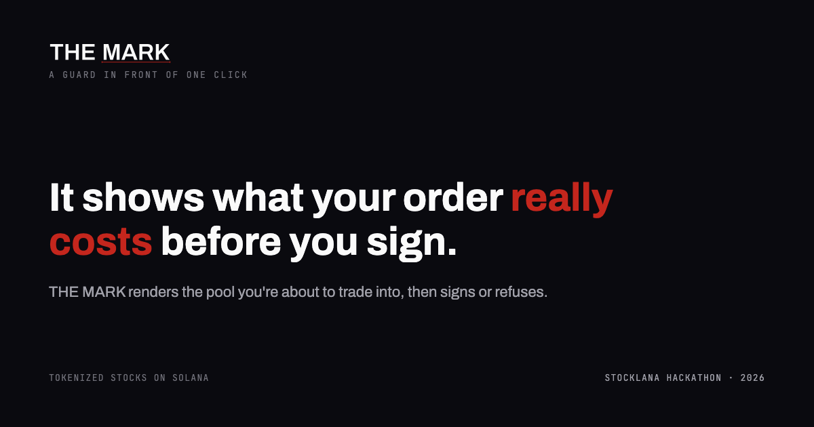

# THE MARK

**A guard in front of one click.** Before you buy a tokenized stock on Solana, THE MARK renders the
liquidity pool you are about to trade into, shows what your exact order really costs, and then signs
or refuses.



---

## The problem, with numbers

Holders of tokenized stocks trade at two in the morning, when the books are thinnest, and nothing
tells them what their order costs.

The field's answer is the read-only dashboard: we counted 14 named public repos in this hackathon
building one, and the number most of them surface is the *gap* between a tokenized stock and the
real share. We measured that gap on 2026-09-22 across 20 pairs: a median of **0.20%**. It is not
where the money goes.

The money goes into the **fill**: the price impact your specific order pays in the specific pool it
routes through. Read live from Jupiter on 2026-09-22 at 19:36 UTC, on a $25,000 order. These are a snapshot; the
`/census` page recomputes them every time it loads:

| token | fill cost |
|---|---|
| INTCx (Intel) | 2.56% |
| PLTRx (Palantir) | 1.56% |
| tOpenAI | 1.74% |
| SPYx (S&P 500) | 0.06% |

That is a spread of roughly 40x between the best and worst pool, on the same order size, in the same
minute. None of it is visible before you sign.

## What this does

Three surfaces, all reading live.

**`/` — the instrument.** The pool is drawn as the constant-product surface it actually is, in
WebGL. Your order is carved into it as a trench whose depth is the impact the router returned for
that exact amount. Move the amount and the trench deepens as the cost counts. Set the worst fill you
will take, and above that line the sign button stops being a button and becomes a refusal that
states the number.

**`/census` — the field.** Every tokenized stock we track, measured at $500, $5,000 and $25,000,
live, on one shared scale, ranked by what the fill actually costs. This is the evidence for the
claim above, recomputed every time the page loads.

**`/proof` — the receipt.** Give it a transaction signature and it reads that transaction off
Solana, decodes what actually moved from the pre and post token balances, and reconciles it against
what the screen promised before it was signed. With the Solscan link, so you can check it yourself.

## The on-chain finding

xStocks are Token-2022 mints carrying a `scaledUiAmountConfig`. The multiplier there changes how
many units a wallet displays, so a cost computed without it is wrong. Tessera's t-tokens carry a
`transferFeeConfig` instead: tOpenAI charges 20 basis points on transfer, which no price feed
includes. THE MARK reads both off the mint account at quote time and puts them in the cost.

`/proof` prints the live extension state for every mint, so the claim is checkable rather than
asserted.

## Rules this codebase follows

Three bans, enforced in review and visible in the code:

1. **No figure on a surface that was not returned by a call made in that moment.** No sample data,
   no placeholder price, no remembered number. When a call fails, the surface says so and shows
   nothing in its place. There is no cache and no fallback price anywhere.
2. **No chart of the token-vs-share gap.** It is 0.20% and everyone else is drawing it.
3. **No green arrow, no confetti, no celebration of a trade.** The product's whole claim is that it
   tells you the cost.

## Running it

```bash
npm install
npm run dev          # http://localhost:3000
npm test             # unit tests for the cost math
npm run build && npm start
```

Optional: set `SOLANA_RPC_URL` to a private RPC. Without it the app uses the public mainnet
endpoint, which is rate-limited and slow. The mint and transaction reads go through this app's own
server routes (`/api/mint`, `/api/tx`) because the public RPC refuses browser-origin requests.

No API keys are required. Jupiter's `lite-api` endpoints are public.

## Stack

Next.js 14 (app router), TypeScript, hand-written WebGL2 for the pool surface (no 3D library),
Jupiter for quotes, prices and swaps, Solana web3.js loaded only at signing time.

## Status

Built and tested. The cost math has unit tests. All three surfaces render and measure clean at 390px
and 1280px. What is not yet proven is stated in `PROGRESS.md` rather than hidden here.
